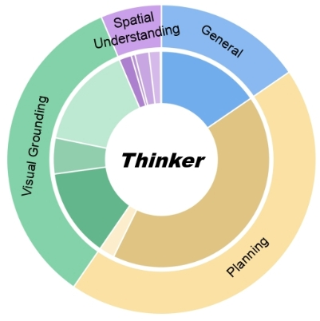
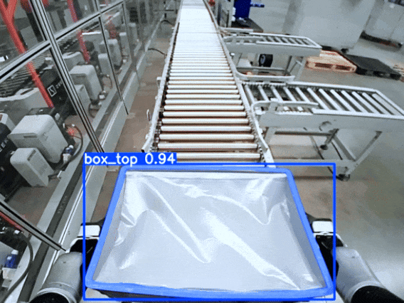
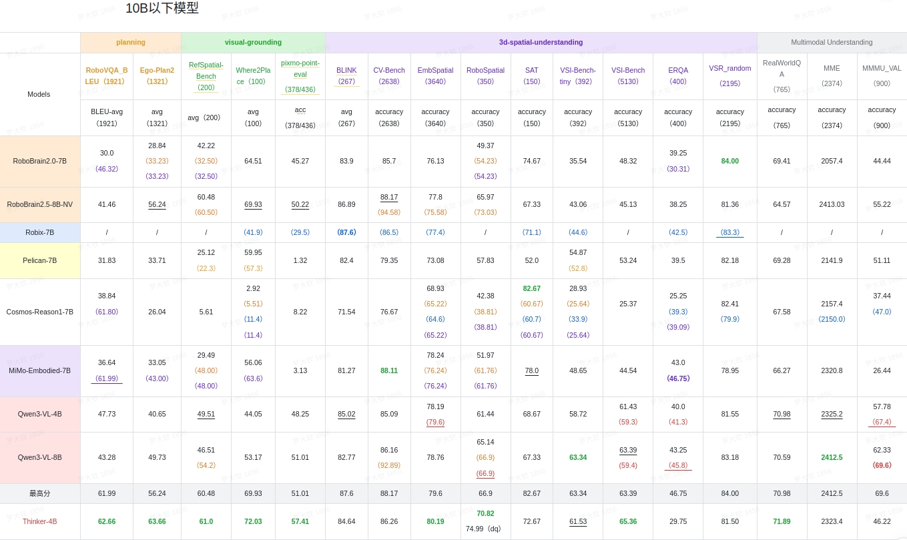
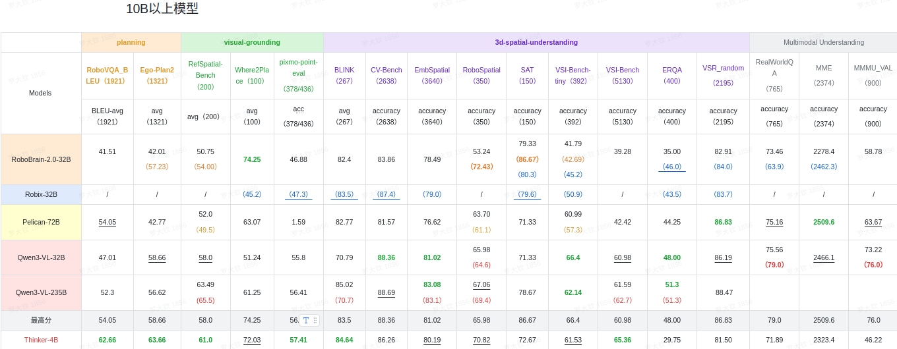

<div align='center'><h1>Thinker: A vision-language foundation model for embodied intelligence</h1></div>

<!--  
[[🤗 Datasets](https://huggingface.co/...)] 
<font size=4><div align='center'>[[🔗 Released Code](https://github.com/UBTECH-Robot/Thinker)]
 [[🤗 Checkpoints](https://huggingface.co/...)]</div></font>
 <font size=4><div align='center'>[[📄 Tech Report](https://arxiv.org/abs/2510.01954)]</div></font>
-->

<font size=4><div align='center'>[[🔗 Released Code](https://github.com/UBTECH-Robot/Thinker)]
 [[🤗 Checkpoints](https://huggingface.co/...)] [[📄 Tech Report](https://arxiv.org)]</div></font>

<div align="center">

</div>

---
## 🌟 Overview

We are pleased to open-source **Thinker**, a state-of-the-art vision-language foundation model specifically engineered for embodied intelligence.
While conventional VLMs often struggle with perspective confusion and temporal oversight, Thinker is designed to bridge the gap between general scene understanding and robust robot-centric task-level capabilities.
By leveraging high-quality dataset curation, multi-stage training, and reinforcement learning, Thinker exhibits advanced capabilities across four core dimensions:
**Task Planning** with future-state prediction, **Spatial Intelligence** grounded in an egocentric coordinate system, **Temporal Understanding** through historical state integration, and precise **Visual Grounding**.
Leveraging these capabilities, Thinker sets new records across 7 embodied AI benchmarks in Task Planning, Visual Grounding and Spatial Understanding, and significantly outperforms existing open-source, closed-source, and specialized baselines, showing its potential as a foundation for embodied intelligence and autonomous robotic decision-making.

<!--Thinker exhibits advanced capabilities in spatial perception, long-horizon video comprehension, and temporal reasoning.-->


<div align="center" style='display: flex; flex-direction: row'>


</div>


---
## Update

- **`2026-xx-xx`**: 🤗 [Thinker-4B](https://huggingface.co/...) model checkpoint has been released in Huggingface.

---
## Quick Start

Clone this repo, and set up the environment with a few commands.

```bash
git clone https://github.com/UBTECH-Robot/Thinker.git
cd Thinker

conda create -n Thinker python=3.11
conda activate Thinker
pip install -r requirements.txt
```

The following contains a code snippet illustrating how to use our Thinker. More details can refer to inference.py.

```python
from transformers import Qwen3VLForConditionalGeneration, AutoProcessor


model = Qwen3VLForConditionalGeneration.from_pretrained(
    "UBTECH-Robotics/Thinker-4B", dtype="auto", device_map="auto"
)


processor = AutoProcessor.from_pretrained("UBTECH-Robotics/Thinker-4B")

messages = [
    {
        "role": "user",
        "content": [
            {
                "type": "image",
                "image": "http://images.cocodataset.org/val2017/000000039769.jpg",
            },
            {"type": "text", "text": "Please point out the free space between two cats."},
        ],
    }
]

# Preparation for inference
inputs = processor.apply_chat_template(
    messages,
    tokenize=True,
    add_generation_prompt=True,
    return_dict=True,
    return_tensors="pt"
)
inputs = inputs.to(model.device)

# Inference: Generation of the output
generated_ids = model.generate(**inputs, max_new_tokens=128)
generated_ids_trimmed = [
    out_ids[len(in_ids) :] for in_ids, out_ids in zip(inputs.input_ids, generated_ids)
]
output_text = processor.batch_decode(
    generated_ids_trimmed, skip_special_tokens=True, clean_up_tokenization_spaces=False
)
print(output_text)
```

---
## 🤗 Models

| Models              | Checkpoint                                                                | Description                              | 
|---------------------|---------------------------------------------------------------------------|------------------------------------------|
| Thinker 4B          | [🤗 UBTECH-Robot/Thinker-4B](https://huggingface.co/BAAI/RoboBrain2.0-3B) | 4B parameter Instruct version of Thinker | 
| Thinker 4B thinking | coming soon                                                               | 4B parameter Thinking version of Thinker |


## Evaluation

More evaluation results and scripts will be added soon.

<div align="center">

</div>


<div align="center">

</div>

## License Agreement

Thinker is licensed under Apache 2.0.

## Citation

We kindly encourage citation of our work if you find it useful.

```

```

